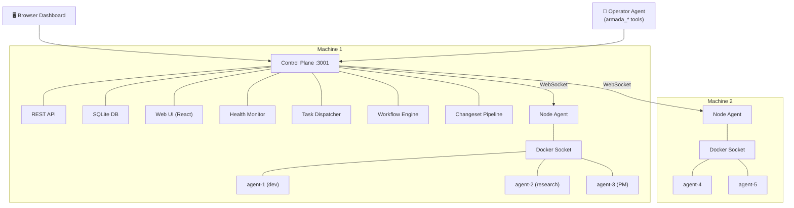

# Armada

> ⚠️ **Under active development.** APIs, schemas, and features may change without notice.

**Give your AI a team, not just a chat window.**

Armada is an orchestration platform for multi-agent teams. Instead of one AI doing everything, you run specialised agents — a developer, a researcher, a project manager, a designer — each in its own Docker container with dedicated tools, resources, and security boundaries.

A control plane coordinates the team. The dashboard shows what's happening. The agents do the work.

## Why Armada?

- **Specialisation** — agents have distinct roles, tools, and skills. A dev agent has repo access and CLI tools. A researcher has web search. They're good at different things.
- **Resource management** — each container gets its own CPU/memory allocation. Spread agents across machines via node agents.
- **Security isolation** — every agent runs in Docker. They can't access each other's filesystems. Communication happens through controlled endpoints only.
- **Multi-node** — add node agents on more machines, spawn agents where there's capacity.
- **Template-driven** — define agent templates (role, model, tools, skills, resources) and spawn instances from them. Reproducible and consistent.
- **Workflow engine** — define multi-step DAG workflows with template variables. Steps dispatch to agents by role, chain outputs, and support review loops.

## Architecture



## Features

### Core
- **Agent management** — spawn, destroy, redeploy agents from templates
- **Task routing** — agents delegate work to each other via `armada_task`
- **Workflow engine** — multi-step DAG execution with role-based dispatch, template variables, and review loops
- **Changeset pipeline** — all config mutations staged, reviewed, and applied atomically
- **Health monitoring** — heartbeat-based agent health with auto-detection of stuck/unhealthy agents
- **Node heartbeat reconciliation** — nodes report container status; control plane auto-corrects stale instance states

### Infrastructure
- **Multi-node** — node agents connect via reverse WebSocket tunnel (no inbound ports needed)
- **Tool provisioning** — declare tools on templates, node agent installs via [eget](https://github.com/zyedidia/eget)
- **Skill management** — install skills from [ClawHub](https://clawhub.com) via templates
- **Credential injection** — securely pass API keys to agents at deploy time

### Dashboard
- **Real-time** — SSE streaming for all state changes, no polling
- **Agent overview** — status, health, role, model, uptime
- **Workflow runs** — step-by-step execution view with collaboration threads
- **Project boards** — per-project kanban with task flow
- **Changeset management** — stage, review, apply, discard config changes
- **AI-generated avatars** — per-agent and per-user avatar generation

### Integrations
- **GitHub** — issue sync, PR workflows, project linking
- **Webhooks** — configurable event-driven notifications
- **OpenClaw plugins** — `armada-agent` (worker) and `armada-control-plugin` (operator)

## Quick Start

### Docker Compose

```bash
git clone https://github.com/coderage-labs/armada.git
cd armada
cp .env.example .env
# Edit .env — set ARMADA_API_TOKEN and ARMADA_NODE_TOKEN
docker compose up -d
```

### Install Script

```bash
# Full stack (control plane + node agent)
curl -fsSL https://raw.githubusercontent.com/coderage-labs/armada/main/install.sh | bash

# Node agent only (additional machines)
curl -fsSL https://raw.githubusercontent.com/coderage-labs/armada/main/install.sh | bash -s -- --node-only --token YOUR_TOKEN
```

## Packages

| Package | Description |
|---------|-------------|
| `packages/control` | Control plane (Fastify + SQLite + Drizzle) |
| `packages/ui` | Dashboard (React + Vite + shadcn/ui) |
| `packages/node` | Node agent (Docker management + WebSocket tunnel) |
| `packages/shared` | Shared types and utilities |
| `plugins/agent` | OpenClaw plugin for managed agent instances |
| `plugins/control` | OpenClaw plugin for the operator agent |
| `plugins/shared` | Shared plugin utilities |

## Roadmap

- **CLI** (`armada agents list`, `armada changesets apply`, `armada events --follow`) — thin client over the REST API for terminal-based fleet management
- **Escalation system** — agents pause and escalate to humans via inline buttons
- **Cost tracking dashboard** — per-agent, per-model usage and spend
- **Scheduled workflows** — cron-triggered DAG runs

## Documentation

- [Developer docs](docs/README.md) — architecture, configuration, API reference
- [Plugin guide](docs/PLUGIN-GUIDE.md) — building OpenClaw plugins for Armada
- [Changeset pipeline](docs/UNIVERSAL-CHANGESET-SPEC.md) — how config mutations work

## Environment Variables

See [`.env.example`](.env.example) for all available configuration.

| Variable | Required | Description |
|---|---|---|
| `ARMADA_API_TOKEN` | ✅ | Master API token for the control plane |
| `ARMADA_NODE_TOKEN` | ✅ | Token for node agent authentication |
| `ARMADA_API_URL` | — | Internal control plane URL (default: `http://armada-control:3001`) |

## Development

```bash
git clone https://github.com/coderage-labs/armada.git
cd armada
npm install
npm run build
npm test        # 693 tests across 63 files
npm run dev     # Start control plane + UI in dev mode
```

## Contributing

See [CONTRIBUTING.md](CONTRIBUTING.md).

## License

[MIT](LICENSE)
