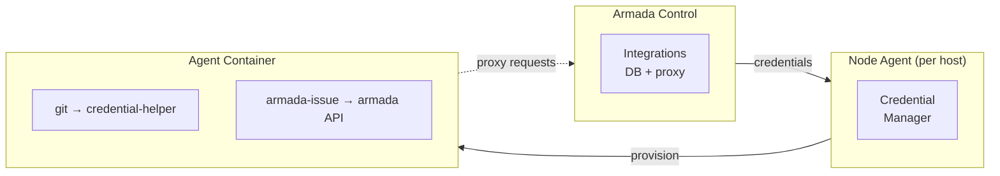

# Secure Credential Injection Spec

## Problem

Agents need to interact with external services (git repos, issue trackers) but must **never see credentials**. Tokens in LLM context risk leaking into logs, memory, or outputs.

Current state: integrations store credentials, but nothing connects them to agents. Agents can't clone private repos or interact with issue trackers unless manually configured.

## Principles

1. **Tokens never appear in agent context** — not in task prompts, environment variables visible to the LLM, or tool outputs
2. **Credential scope follows project membership** — agents access what their projects allow, nothing more
3. **Concurrent access** — agents work on multiple projects simultaneously; credentials for all active memberships are available at once
4. **Lifecycle tied to membership** — credentials provisioned on project assignment, revoked on removal, refreshed on integration changes

## Architecture



## 1. Git Credential Helper

### How it works

A git credential helper is a program git calls when it needs auth for a URL. We provide a custom one in each agent container.

```
# In agent container's git config (~/.gitconfig)
[credential]
    helper = /usr/local/bin/armada-credential-helper
```

The helper is a small script/binary that reads a credentials file maintained by the node agent:

```
# /etc/armada/git-credentials.json (written by node agent, read-only to agent process)
{
  "credentials": [
    {
      "host": "github.com",
      "paths": ["acme-org/acme-app", "acme-org/acme-docs"],
      "protocol": "https",
      "username": "x-access-token",
      "password": "<token>"
    },
    {
      "host": "bitbucket.org",
      "paths": ["acme-corp/*"],
      "protocol": "https",
      "username": "deploy-bot",
      "password": "<app-password>"
    }
  ]
}
```

### Credential helper binary

Simple shell script or Go binary:

```bash
#!/bin/sh
# /usr/local/bin/armada-credential-helper
# Reads /etc/armada/git-credentials.json
# Matches host+path from git's request
# Returns username/password on stdout in git credential format
```

The file is **not readable by the LLM** — the agent process can execute git (which calls the helper), but can't `cat` the credentials file. Enforced via file permissions:
- Owner: root (or armada-agent service user)
- Permissions: 0600
- The credential helper binary is setuid or runs via a small socket/daemon

### Alternative: credential helper daemon

Instead of a file, the credential helper calls a local Unix socket served by a sidecar process (part of the node agent or a lightweight daemon injected into the container). This avoids any credential file on disk entirely:

```
git push → credential helper → Unix socket → node agent → armada DB → token
```

**Recommendation**: Start with the file approach (simpler), move to socket if needed.

## 2. Issue Tracker Proxy

Agents need to read issues, add comments, transition statuses, etc. They can't call external APIs directly (no tokens).

### Armada API proxy endpoints

Armada control already has the integration credentials in its DB. Add proxy endpoints:

```
POST /api/proxy/issues/list
POST /api/proxy/issues/get
POST /api/proxy/issues/comment
POST /api/proxy/issues/transition
POST /api/proxy/issues/search
```

Request format:
```json
{
  "project": "acme",
  "issueKey": "ACME-123",
  "comment": "Fixed in commit abc123"
}
```

Armada control:
1. Looks up the project's issue integration
2. Gets the stored credentials (decrypted)
3. Calls the external API via the appropriate adapter
4. Returns sanitised results (no auth headers, no token leakage)

### Agent-side: `armada-issue` tool

Rather than agents constructing HTTP requests to the proxy, register armada tools that abstract it:

```
armada_issue_list       - List issues for a project
armada_issue_get        - Get issue details
armada_issue_comment    - Add a comment
armada_issue_transition - Change issue status
armada_issue_search     - Search issues (JQL, GitHub query, etc.)
armada_issue_sync       - Trigger issue sync for a project
```

These tools are registered on agents via the Armada plugin. The plugin calls Armada control's proxy endpoints server-side. Agents use them like any other tool.

**Key**: these tools accept project name/ID, not integration credentials. The Armada plugin resolves project → integration → credentials internally.

### Access control

Not every agent should access every project's issues. The proxy checks:

1. Is the requesting agent a member of the specified project?
2. Does the project have an integration with `issues` capability?
3. Is the integration status `active`?

Denied requests return a clear error: "Agent X is not a member of project Y" or "Project Y has no issue integration configured."

### Triage use case

A triage/PM agent (e.g., nexus) needs to:
- **Read** issues from all assigned projects
- **Search** by labels, status, priority
- **Comment** (e.g., "Triaged: assigning to forge")
- **Transition** (e.g., move to "In Progress")

This works naturally — nexus is a member of the project, so it has proxy access. It uses `armada_issue_list` and `armada_issue_search` to read the backlog, `armada_issue_comment` to annotate, `armada_issue_transition` to update status. No tokens anywhere in its context.

## 3. Credential Lifecycle

### Provisioning (on project membership change)

When an agent is added to a project (or a project's integrations change):

1. Armada control calls node agent: `POST /agents/:name/credentials/sync`
2. Node agent fetches the agent's full credential set from Armada control: `GET /api/agents/:name/credentials` (internal endpoint, node-agent auth only)
3. Armada control computes: all projects the agent is a member of → all integrations with VCS capability → all repo URLs + credentials
4. Node agent writes the git credentials file into the agent's container (via `docker exec` or volume mount)
5. Node agent signals the agent (optional — git reads credentials fresh each time)

### Refresh triggers

Credential sync is triggered by:
- Agent added/removed from a project
- Project integration created/updated/deleted
- Integration credentials rotated
- Integration status changes (e.g., expired → active after token refresh)
- Manual sync via API

### Revocation (on membership removal)

When an agent is removed from a project:
1. Armada control calls credential sync
2. Node agent rewrites the credentials file without the removed project's repos
3. Agent immediately loses git access to those repos (next `git fetch` fails)

### Token expiry

Atlassian API tokens now expire after 1 year. The integration's `status` field tracks this. When a token expires:
1. Integration status → `expired`
2. Credential sync removes expired credentials from agents
3. User notified to rotate the token
4. On update → status back to `active`, credential sync pushes new token

## 4. Issue Sync Service

Separate from credential injection but related — periodic sync of external issues into armada's `external_issues` table.

### Sync triggers

- **Manual**: "Sync Now" button in UI, or `armada_project_integration_sync` tool
- **On task dispatch**: when a workflow step references issues, sync first
- **Periodic**: configurable interval per project-integration (e.g., every 15min, hourly)
  - Implemented via a sync scheduler in Armada control (not cron — internal timer)

### Sync flow

1. Fetch issues via adapter (using stored credentials)
2. Upsert into `external_issues` table
3. Diff against previous sync — identify new, changed, closed
4. Emit events for new/changed issues (SSE, notifications)
5. Update `last_synced_at` on the project-integration record

### Triage integration

When new issues come in via sync:
1. If project has auto-triage enabled → dispatch to PM agent
2. PM agent uses `armada_issue_get` to read full details (via proxy, no tokens)
3. PM agent triages: priority, assignment, workflow trigger
4. PM agent uses `armada_issue_comment` to annotate the external issue

## 5. Node Agent Changes

### New endpoints

```
POST /agents/:name/credentials/sync
  - Called by Armada control
  - Node agent fetches full credential set, writes to container
  - Auth: Armada control's node agent token

GET /agents/:name/credentials/status
  - Returns credential health: which projects, last synced, any errors
  - Used by Armada control for monitoring
```

### Container modifications

When spawning an agent container, node agent:
1. Mounts a credentials volume: `/etc/armada/` (read-only to agent process)
2. Installs the git credential helper binary (baked into agent image or injected)
3. Configures `~/.gitconfig` to use the credential helper

### Image changes

The Armada agent Docker image (`ghcr.io/openclaw/openclaw`) needs:
- `/usr/local/bin/armada-credential-helper` binary
- Default `~/.gitconfig` with credential helper configured
- Correct file permissions on `/etc/armada/`

**Option**: instead of modifying the base image, the node agent injects these on container creation via bind mounts + docker exec.

## 6. Armada Control API Changes

### New internal endpoint (node-agent only)

```
GET /api/agents/:name/credentials
  Response: {
    git: [
      { host, paths[], protocol, username, password }
    ],
    integrations: [
      { projectId, projectName, integrationId, provider, capabilities }
    ]
  }
```

This endpoint is **internal** — authenticated via node agent token only. Never exposed to agents or external clients.

### New proxy endpoints

```
POST /api/proxy/issues/list     { project, filters? }
POST /api/proxy/issues/get      { project, issueKey }
POST /api/proxy/issues/comment  { project, issueKey, comment }
POST /api/proxy/issues/transition { project, issueKey, status }
POST /api/proxy/issues/search   { project, query }
```

Auth: agent bearer token (from Armada plugin). Agent identity verified, project membership checked.

### Tool definitions

Register proxy tools for agents:

```
armada_issue_list       - List issues for a project backlog
armada_issue_get        - Get full issue details by key
armada_issue_comment    - Add comment to an issue
armada_issue_transition - Change issue status/state
armada_issue_search     - Search issues with provider-specific query
```

## 7. Agent Experience

From an agent's perspective:

### Git access
```
# Just works — credential helper handles auth
git clone https://github.com/acme-org/acme-app
git push origin feature/fix-123
```

### Issue tracker access
```
# Via armada tools (registered by Armada plugin)
armada_issue_list(project="acme", filters={status: "open"})
armada_issue_get(project="acme", issueKey="ACME-123")
armada_issue_comment(project="acme", issueKey="ACME-123", comment="PR opened: #456")
armada_issue_transition(project="acme", issueKey="ACME-123", status="In Review")
```

### What agents know
- Repo URLs (not sensitive)
- Project names (not sensitive)
- Tool names and parameters (not sensitive)

### What agents never see
- API tokens
- App passwords
- SSH private keys
- OAuth tokens
- Auth headers

## 8. Implementation Order

### Phase 1: Issue proxy (highest value, simplest)
1. Proxy endpoints on Armada control
2. Tool definitions registered for agents
3. Armada plugin calls proxy endpoints
4. Access control via project membership

### Phase 2: Issue sync service
1. Sync scheduler in Armada control
2. External issues table population
3. New/changed issue events
4. Triage integration

### Phase 3: Git credential injection
1. Credential helper binary
2. Node agent credential sync endpoint
3. Container credential volume setup
4. Refresh triggers wired up

### Phase 4: Automation
1. Auto-sync on schedule
2. Auto-triage on new issues
3. Credential rotation alerts
4. Expiry monitoring

## Decisions

1. **Credential helper**: File-based. Node agent writes JSON credentials file, credential helper reads it. Simpler to implement, acceptable risk with proper file permissions.

2. **Agent image**: Inject at container creation (bind mount + docker exec). No upstream image changes required, armada-specific, works with any OpenClaw image.

3. **OAuth token refresh**: Pre-emptive. Check expiry timestamps and refresh ahead of time to avoid failed requests. Proxy handles this transparently.

4. **Rate limiting**: Trust agents for now. Pass through external API rate limit errors (429) directly. Add per-agent limits later if needed.

5. **Audit trail**: Yes. Log all proxy requests with agent name, project, action, timestamp. Rotate after 30 days.
