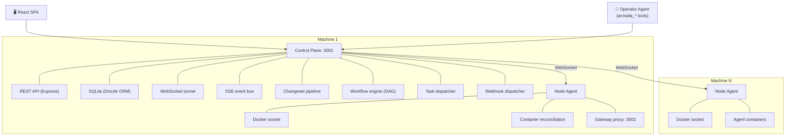

# Armada — Developer Documentation

> **Quick links:** [Architecture](#architecture) · [Quick Start](#quick-start) · [Configuration](#configuration) · [API Overview](#api-overview) · [Webhooks](#webhooks)

---

## Architecture

Armada is a three-tier system: a **control plane**, one or more **node agents**, and **agent containers** (instances).



### Control Plane

The control plane (`packages/control`) is a Node.js server (Express) that:

- Serves the React dashboard (`packages/ui`) via Vite-built static files
- Exposes the REST API (all endpoints under `/api/`)
- Maintains a SQLite database via Drizzle ORM (auto-migrating, currently at v30)
- Manages WebSocket tunnels to each node agent (nodes dial outbound — no inbound ports required)
- Runs: health monitor, task dispatcher, workflow engine, changeset pipeline, webhook dispatcher

### Node Agent

The node agent (`packages/node`) runs on each host machine. It:

- Manages Docker containers (create, start, stop, remove)
- Connects **outbound** to the control plane via WebSocket (no inbound ports needed on the node)
- Reports container statuses in heartbeats for automatic reconciliation
- Relays API requests from the control plane to containers via `instance.relay` commands
- Streams real-time CPU/memory/network stats
- Provisions CLI tools via [eget](https://github.com/zyedidia/eget)
- Runs a **local HTTP proxy on port 3002** that instances use to reach the control plane

### Agent Containers (Instances)

Each instance runs in a Docker container with the `armada-agent` OpenClaw plugin installed. Instances:

- Receive tasks via `POST /armada/task` (relayed from the control plane via the node agent)
- Communicate back to the control plane through the **node agent proxy** (`http://armada-node:3002`) — never directly
- Report heartbeats and task results via the proxy

The `armada-agent` plugin handles task execution, heartbeats, progress reporting, and result callbacks. See [Plugin Guide](./PLUGIN-GUIDE.md) and the [armada-agent README](../plugins/agent/README.md).

---

## Quick Start

### Control Plane — One Command

```bash
docker run -d \
  --name armada-control \
  -p 3001:3001 \
  -v armada-data:/data \
  --restart unless-stopped \
  ghcr.io/coderage-labs/armada:latest
```

That's it. Armada is now running at `http://<your-host>:3001`.

- **`-v armada-data:/data`** — persists the SQLite database and encryption key across restarts/upgrades
- **Port 3001** — the combined API and UI
- **First visit** triggers the setup wizard (create your admin account)
- **Node install** is separate — get the install command from the UI: Nodes → Add Node

#### Or use the install script

```bash
curl -fsSL http://<your-host>:3001/api/install/control | bash
```

#### Or use Docker Compose

Download a ready-to-use `docker-compose.yml` (includes optional Cloudflare Tunnel):

```bash
curl -fsSL http://<your-host>:3001/api/install/compose -o docker-compose.yml
docker compose up -d
```

---

### Development Setup

### Prerequisites

- Node.js 20+
- Docker
- (Optional) An OpenClaw instance as the operator agent

### 1. Clone and build

```bash
git clone https://github.com/coderage-labs/armada.git
cd armada
npm install
npm run build
```

### 2. Configure

```bash
cp .env.example .env
# Set ARMADA_API_TOKEN and ARMADA_NODE_TOKEN
```

### 3. Start with Docker Compose

```bash
docker compose up -d
```

This starts:
- `armada-control` on port 3001 (dashboard + API)
- `armada-node` on the same host, connected to the local Docker socket

### 4. Open the dashboard

Visit `http://localhost:3001`. First-boot setup will prompt you to create an admin account.

### 5. Add more nodes (optional)

On a remote machine, use the install script from the Nodes page or:

```bash
curl -fsSL https://raw.githubusercontent.com/coderage-labs/armada/main/install.sh | bash -s -- --node-only --token YOUR_TOKEN
```

---

## Configuration

### Environment Variables

| Variable | Default | Description |
|---|---|---|
| `ARMADA_API_TOKEN` | *(required)* | Master API token |
| `ARMADA_NODE_TOKEN` | *(required)* | Node agent authentication token |
| `ARMADA_API_URL` | `http://armada-control:3001` | Internal control plane URL (used for agent callback base URL) |
| `ARMADA_AGENT_GATEWAY_URL` | `http://armada-node:3002` | Proxy URL injected into instance configs — how instances reach the control plane |
| `ARMADA_UI_URL` | — | Public URL of the dashboard (for notification links) |
| `ARMADA_DB_PATH` | `/data/armada.db` | SQLite database path |
| `ARMADA_PLUGINS_PATH` | `/data/plugins` | Plugin storage directory |
| `ARMADA_AVATAR_MODEL` | `openai/dall-e-3` | Model for AI avatar generation |
| `ARMADA_TELEGRAM_BOT_TOKEN` | — | Telegram bot for notifications |
| `ARMADA_TELEGRAM_CHAT_ID` | — | Telegram chat for notifications |

---

## API Overview

All routes under `/api/`. Authenticate with `Authorization: Bearer <token>` or session cookie.

### Agents

| Method | Path | Description |
|---|---|---|
| `GET` | `/api/agents` | List agents |
| `POST` | `/api/agents` | Create agent |
| `DELETE` | `/api/agents/:name` | Delete agent |
| `POST` | `/api/agents/:name/redeploy` | Redeploy (restart) agent |
| `GET` | `/api/agents/:name/logs` | Get agent container logs |
| `POST` | `/api/agents/:name/heartbeat` | Receive heartbeat from agent |
| `POST` | `/api/agents/:name/nudge` | Send a nudge to agent |
| `POST` | `/api/agents/:name/maintain` | Trigger maintenance |
| `GET` | `/api/agents/capacity` | Get agent capacity info |
| `GET` | `/api/agents/:name/session` | List agent sessions |
| `GET` | `/api/agents/:name/session/messages` | Get session message history |
| `POST` | `/api/agents/:name/avatar/generate` | Generate AI avatar |
| `DELETE` | `/api/agents/:name/avatar` | Remove avatar |

### Instances

| Method | Path | Description |
|---|---|---|
| `GET` | `/api/instances` | List instances |
| `GET/PATCH/DELETE` | `/api/instances/:id` | Instance CRUD |
| `POST` | `/api/instances/:id/start` | Start instance |
| `POST` | `/api/instances/:id/stop` | Stop instance |

### Nodes

| Method | Path | Description |
|---|---|---|
| `GET` | `/api/nodes` | List nodes |

### Templates

| Method | Path | Description |
|---|---|---|
| `GET` | `/api/templates` | List templates |
| `POST` | `/api/templates` | Create template |
| `GET/PUT/DELETE` | `/api/templates/:id` | Template CRUD |
| `GET` | `/api/templates/:id/drift` | Check agent drift from template |
| `POST` | `/api/templates/:id/sync` | Sync template to agents |

### Tasks

| Method | Path | Description |
|---|---|---|
| `GET` | `/api/tasks` | List tasks |
| `POST` | `/api/tasks` | Create task |
| `GET` | `/api/tasks/:id` | Get task detail |
| `PUT` | `/api/tasks/:id` | Update task status |
| `POST` | `/api/tasks/:id/result` | Task completion callback (called by agents) |

### Workflows

| Method | Path | Description |
|---|---|---|
| `GET` | `/api/workflows` | List workflows |
| `POST` | `/api/workflows` | Create workflow |
| `GET/PUT/DELETE` | `/api/workflows/:id` | Workflow CRUD |
| `POST` | `/api/workflows/:id/run` | Start a run (accepts `variables`) |
| `GET` | `/api/workflows/:id/runs` | List runs for workflow |
| `GET` | `/api/workflows/runs/active` | Get active runs |
| `GET` | `/api/workflows/runs/recent` | Get recent runs |
| `GET` | `/api/workflows/runs/:runId` | Run status |
| `GET` | `/api/workflows/runs/:runId/steps` | Step statuses |
| `GET` | `/api/workflows/runs/:runId/context` | Full context (steps + outputs + reworks) |
| `POST` | `/api/workflows/runs/:runId/approve/:stepId` | Approve a workflow step |
| `POST` | `/api/workflows/runs/:runId/reject/:stepId` | Reject a workflow step |
| `POST` | `/api/workflows/runs/:runId/retry/:stepId` | Retry a failed step |
| `POST` | `/api/workflows/runs/:runId/cancel` | Cancel a run |
| `POST` | `/api/workflows/runs/:runId/rework` | Request rework on a step |

### Changesets

| Method | Path | Description |
|---|---|---|
| `GET` | `/api/changesets` | List changesets |
| `POST` | `/api/changesets` | Create changeset |
| `GET` | `/api/changesets/:id` | Get changeset detail (includes steps and diffs) |
| `POST` | `/api/changesets/:id/approve` | Approve a draft changeset |
| `POST` | `/api/changesets/:id/validate` | Validate a changeset |
| `POST` | `/api/changesets/:id/apply` | Apply an approved changeset |
| `POST` | `/api/changesets/:id/cancel` | Cancel a draft or approved changeset |
| `POST` | `/api/changesets/:id/retry` | Retry a failed changeset |

### Events

| Method | Path | Description |
|---|---|---|
| `GET` | `/api/events/stream` | SSE stream (all state changes) |

### Auth

| Method | Path | Description |
|---|---|---|
| `POST` | `/api/auth/login/password` | Password login |
| `POST` | `/api/auth/passkey/login-options` | WebAuthn challenge |
| `POST` | `/api/auth/passkey/login-verify` | WebAuthn verify |
| `GET` | `/api/auth/setup-status` | Check if first-boot setup is needed (public) |
| `POST` | `/api/auth/setup` | First-boot admin setup (public, only works before any users exist) |
| `GET` | `/api/auth/me` | Current user profile |
| `PUT` | `/api/auth/me` | Update profile |

---

## Webhooks

### Outbound

Control plane POSTs to external URLs when events occur. Configure via the Webhooks page or API.

### Inbound

External services POST to Armada to trigger actions:

1. Create an inbound webhook (dashboard or `POST /api/webhooks/inbound`)
2. Armada generates a unique URL: `https://your-armada.example.com/hooks/<hookId>`
3. Configure the external service to POST to that URL

**Actions:** `workflow` (start a run), `task` (create a task), `event` (emit to event bus)

**Signature verification:** If a `secret` is configured, Armada verifies HMAC-SHA256 via `X-Hub-Signature-256` or `X-Armada-Signature` headers.

---

## Further Reading

- [Architecture](./ARCHITECTURE.md) — core concepts, communication flows, and topology
- [Changeset pipeline](./UNIVERSAL-CHANGESET-SPEC.md) — how config mutations work
- [Collaboration spec](./COLLABORATION-SPEC.md) — inter-agent workflow collaboration
- [Credential injection](./CREDENTIAL-INJECTION-SPEC.md) — secure key management
- [Plugin guide](./PLUGIN-GUIDE.md) — building OpenClaw plugins for Armada
- [Reverse tunnel architecture](./REVERSE-TUNNEL-ARCHITECTURE.md) — node agent connectivity
- [Service layer](./SERVICE-LAYER-SPEC.md) — backend service architecture
- [UI design system](./UI-DESIGN-SYSTEM.md) — dashboard design principles
