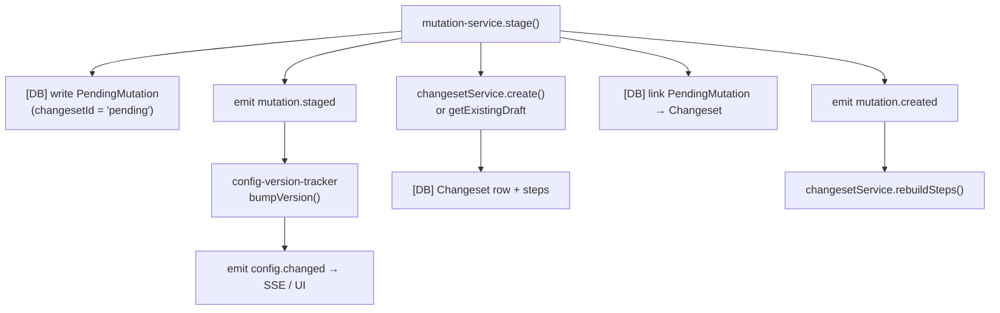
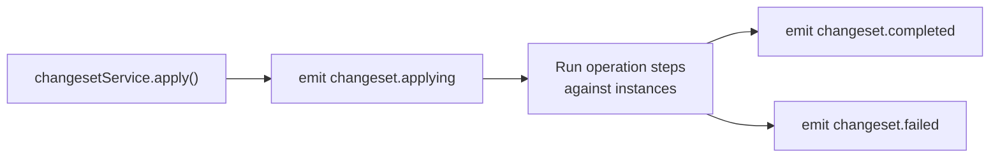

# Armada — Event Bus Map

> **Quick reference:** All internal events emitted/consumed via the singleton `eventBus`
> (`packages/control/src/infrastructure/event-bus.ts`).
>
> Canonical string constants → `event-names.ts` in this directory.  
> Pattern matching: `instance.*` matches any event starting with `instance.`;
> `*` matches everything.

---

## Mutation → Changeset Pipeline (the critical chain)



Later, when operator applies the changeset:



---

## Events

### mutation.staged
- **Emitted by:** `services/mutation-service.ts` → `stage()`
- **Listened by:** `infrastructure/config-version-tracker.ts` → bumps config version + emits `config.changed`
- **Payload:** `{ entityType: EntityType, action: 'create' | 'update' | 'delete', entityId?: string }`
- **Triggers:** `config.changed`
- **Notes:** Emitted *before* the changeset is created so that `bumpVersion()` marks instances as
  pending-restart, giving `changesetService.create()` the pending changes it needs to build steps.

---

### mutation.created
- **Emitted by:** `services/mutation-service.ts` → `stage()` (after changeset is linked)
- **Listened by:** `index.ts` startup → calls `changesetService.rebuildSteps(changesetId)`
- **Payload:** `{ changesetId: string }`
- **Triggers:** changeset step rebuild
- **Notes:** Listener is registered in `index.ts` `start()` — not in the service itself to avoid a
  circular import between `mutation-service` ↔ `changeset-service`.

---

### config.changed
- **Emitted by:** `infrastructure/config-version-tracker.ts` → `initConfigVersionTracker()`
- **Listened by:** `routes/events.ts` SSE stream (forwarded to UI clients)
- **Payload:** `{}` (empty — consumers just re-fetch config)
- **Triggers:** UI re-fetches config diff / pending-restart badge
- **Notes:** Fires for every event in `CONFIG_CHANGE_EVENTS`; payload is intentionally empty.
  See also **Dead Listeners** section below.

---

### changeset.applying
- **Emitted by:** `services/changeset-service.ts` → `apply()`
- **Listened by:** SSE stream (`routes/events.ts`), badges route
- **Payload:** `{ changesetId: string }`
- **Triggers:** UI shows "applying" state

---

### changeset.completed
- **Emitted by:** `services/changeset-service.ts` → `apply()`
- **Listened by:** SSE stream, badges route
- **Payload:** `{ changesetId: string }`
- **Triggers:** UI clears pending-restart badge

---

### changeset.failed
- **Emitted by:** `services/changeset-service.ts` → `apply()`
- **Listened by:** SSE stream, badges route
- **Payload:** `{ changesetId: string, error: string }`
- **Triggers:** UI shows error state

---

### changeset.discarded
- **Emitted by:** `services/changeset-service.ts` → `discard()`
- **Listened by:** SSE stream
- **Payload:** `{ changesetId: string, mutationsRemoved: number }`

---

## Instance Events

### instance.restarting
- **Emitted by:** `services/instance-manager.ts` → `restart()`
- **Listened by:** SSE stream, badges route (`instance.*`)
- **Payload:** `{ instanceId: string, name: string }`

---

### instance.restarted
- **Emitted by:** `services/instance-manager.ts` → `restart()`
- **Listened by:** SSE stream, badges route
- **Payload:** `{ instanceId: string, name: string }`

---

### instance.stopped
- **Emitted by:** `services/instance-manager.ts` → `stop()`
- **Listened by:** SSE stream, badges route
- **Payload:** `{ instanceId: string, name: string }`

---

### instance.started
- **Emitted by:** `services/instance-manager.ts` → `start()`
- **Listened by:** SSE stream, badges route
- **Payload:** `{ instanceId: string, name: string }`

---

### instance.reloaded
- **Emitted by:** `services/instance-manager.ts` → `reload()`
- **Listened by:** SSE stream, badges route
- **Payload:** `{ instanceId: string, name: string }`

---

### instance.upgraded
- **Emitted by:** `services/instance-manager.ts` → `upgrade()`
- **Listened by:** SSE stream, badges route
- **Payload:** `{ instanceId: string, name: string, version: string }`

---

### instance.upgrade_failed
- **Emitted by:** `services/instance-manager.ts` → `upgrade()`
- **Listened by:** SSE stream, badges route
- **Payload:** `{ instanceId: string, name: string, targetVersion: string }`

---

### instance.maintenance_completed
- **Emitted by:** `services/instance-manager.ts` → `runMaintenance()`
- **Listened by:** SSE stream, badges route
- **Payload:** `{ instanceId: string, name: string }`

---

### instance.maintenance_failed
- **Emitted by:** `services/instance-manager.ts` → `runMaintenance()`
- **Listened by:** SSE stream, badges route
- **Payload:** `{ instanceId: string, name: string }`

---

### instance.ready
- **Emitted by:** `routes/instances.ts` → `POST /api/instances/:id/heartbeat` handler
- **Listened by:** `infrastructure/steps/health-check.ts` → resolves health-check promise
- **Payload:** `{ instanceId: string, instanceName: string, status: string, agents: any[], reportedAgents: string[] }`
- **Triggers:** Unblocks any in-flight `health-check` step waiting for a restart to complete
- **Notes:** The health-check step races this event against a direct HTTP probe; whichever resolves
  first wins.

---

## Agent Events

### agent.spawned
- **Emitted by:** `services/spawn-manager.ts` → `spawn()`
- **Listened by:** SSE stream
- **Payload:** `{ agentId: string, name: string, templateId: string, role: string, status: string }`

---

### agent.removed
- **Emitted by:** `services/agent-manager.ts` → `removeAgent()`
- **Listened by:** SSE stream
- **Payload:** `{ agentId: string, name: string }`

---

### agent.updated
- **Emitted by:** `services/agent-manager.ts` → `generateAvatar()` / avatar-update path
- **Listened by:** SSE stream
- **Payload:** `{ ...agentFields, avatarGenerating?: 1 }`
- **Notes:** Also emitted with the resolved agent after avatar generation completes.

---

### agent.status
- **Emitted by:** `services/agent-manager.ts` → `processHeartbeat()`
- **Listened by:** SSE stream
- **Payload:** `{ agentId: string, name: string, status: 'running', previousStatus: string }`
- **Notes:** Only emitted when status *changes*; not on every heartbeat.

---

### agent.heartbeat
- **Emitted by:** `services/agent-manager.ts` → `processHeartbeat()`
- **Listened by:** SSE stream (high frequency — consider filtering in UI)
- **Payload:** `{ name: string, ...cleanMeta }` (sanitised heartbeat metadata)

---

### agent:updated  ⚠️ non-standard separator
- **Emitted by:** `infrastructure/steps/health-check.ts` → post-health-check
- **Listened by:** *(no listener found — appears to be legacy or for external consumers)*
- **Payload:** `{ instanceId: string }`
- **Notes:** Uses a **colon** separator (`agent:updated`) unlike all other events which use dots.
  This will **not** match an `agent.*` wildcard subscription. Likely a bug or legacy artefact.

---

## Plugin Events

### plugin.installed
- **Emitted by:** `services/plugin-manager.ts` → `install()`
- **Listened by:** `config-version-tracker` → bumps config version
- **Payload:** `{ name: string }`

---

### plugin.library.add
- **Emitted by:** `services/plugin-manager.ts` → `addToLibrary()`
- **Listened by:** SSE stream
- **Payload:** `{ plugin: PluginRecord }`

---

### plugin.library.update
- **Emitted by:** `services/plugin-manager.ts` → `updateInLibrary()`
- **Listened by:** `config-version-tracker`, SSE stream
- **Payload:** `{ plugin: PluginRecord }`

---

### plugin.library.remove
- **Emitted by:** `services/plugin-manager.ts` → `removeFromLibrary()`
- **Listened by:** `config-version-tracker`, SSE stream
- **Payload:** `{ name: string }`

---

## Operation Events

All operation events share the wildcard `operation.*` subscribed to by `routes/operations.ts`
(per-operation SSE) and `routes/badges.ts` (badge refresh).

### operation.created
- **Emitted by:** `infrastructure/operations.ts` → `create()`
- **Payload:** `{ operationId: string, type: string, target: string }`

### operation.running
- **Emitted by:** `infrastructure/operations.ts` → when execution begins
- **Payload:** `{ operationId: string }`

### operation.progress
- **Emitted by:** `infrastructure/operations.ts` → step progress callback  
  Also: `routes/node-ws.ts` → forwarding node-reported progress
- **Payload:** `{ operationId: string, step: string, message: string, ...extraData }`

### operation.steps_updated
- **Emitted by:** `infrastructure/operations.ts` → when step list changes
- **Payload:** `{ operationId: string, steps: OperationStep[] }`

### operation.completed
- **Emitted by:** `infrastructure/operations.ts` → on success
- **Payload:** `{ operationId: string, result: any | null }`

### operation.failed
- **Emitted by:** `infrastructure/operations.ts` → on error
- **Payload:** `{ operationId: string, error: string }`

### operation.cancelled
- **Emitted by:** `infrastructure/operations.ts` → on cancellation
- **Payload:** `{ operationId: string }`

---

## Task Events

### task.created
- **Emitted by:** `routes/tasks.ts` → `POST /api/tasks`
- **Listened by:** SSE stream
- **Payload:** `{ taskId: string, projectId: string | null, agentName: string, summary: string }`
- **Notes:** `summary` is truncated to 120 chars.

---

### task.status
- **Emitted by:** `services/task-manager.ts` → `updateStatus()`  
  Also: `routes/tasks.ts` → `PATCH /api/tasks/:id`
- **Listened by:** SSE stream
- **Payload:** `{ taskId: string, status: string, agentName: string }`

---

### task.completed
- **Emitted by:** `services/task-manager.ts` → `updateStatus()` when status becomes terminal
- **Listened by:** SSE stream
- **Payload:** `{ taskId: string, agentName: string, success: boolean }`

---

## Node Events

### node.connected
- **Emitted by:** `ws/node-connections.ts` → `addConnection()`
- **Listened by:** SSE stream
- **Payload:** `{ nodeId: string, connectedAt: string }` (ISO timestamp)

---

### node.disconnected
- **Emitted by:** `ws/node-connections.ts` → connection close handler
- **Listened by:** SSE stream
- **Payload:** `{ nodeId: string, disconnectedAt: string }` (ISO timestamp)

---

### node.stale
- **Emitted by:** `ws/node-connections.ts` → heartbeat staleness check
- **Listened by:** SSE stream
- **Payload:** `{ nodeId: string, lastHeartbeat: string, ageMs: number }`

---

### node.stats
- **Emitted by:** `routes/node-ws.ts` → stats message handler
- **Listened by:** SSE stream
- **Payload:** `{ nodeId: string, ...statsFields }` (CPU, memory, etc. from node agent)

---

## Activity Events

### activity.created
- **Emitted by:** `services/activity-service.ts` → `logActivity()`
- **Listened by:** `routes/activity.ts` → forwards to SSE activity stream
- **Payload:** `ActivityEvent` record (id, eventType, agentName?, detail?, metadata?, createdAt)
- **Notes:** This is the internal bridge between the DB write and SSE push.
  `logActivity()` does both atomically: `activityRepo.create()` + `eventBus.emit('activity.created')`.

---

## GitHub Sync Events

### github.new_issues
- **Emitted by:** `services/github-sync.ts` → polling loop, when new untriagedissues are detected
- **Listened by:** `services/triage.ts` → routes issues to PM-tier agents or leaves for operator
- **Payload:** `{ projectId: string, projectName: string, issueNumbers: number[] }`

---

## Template Events

### template.updated
- **Emitted by:** `routes/templates.ts` → `PATCH /api/templates/:id`
- **Listened by:** SSE stream
- **Payload:** `{ templateId: string }`

---

## Webhook Events

### webhook.inbound.delivered
- **Emitted by:** `routes/webhooks-inbound.ts` → after any webhook action completes
- **Listened by:** SSE stream
- **Payload (workflow action):** `{ hookId: string, hookName: string, action: 'workflow', runId: string }`
- **Payload (task action):** `{ hookId: string, hookName: string, action: 'task', taskId: string }`
- **Payload (event action):** `{ hookId: string, hookName: string, action: 'event', eventName: string }`

### `<custom eventName>` (dynamic)
- **Emitted by:** `routes/webhooks-inbound.ts` when hook action is `'event'`
- **Payload:** `{ hookId: string, hookName: string, payload: any }` (raw webhook body)
- **Notes:** Event name comes from `hookActionConfig.eventName`; falls back to
  `webhook.inbound.<hookId>`. Allows webhooks to trigger arbitrary internal events.

---

## SSE Forwarding — `routes/events.ts`

`GET /api/events/stream` subscribes the SSE client to the event bus:
- **No `topics` param:** wildcard `*` — all events forwarded  
- **With `topics`:** each topic becomes a wildcard pattern, e.g. `instance` → `instance.*`

Clients can send `Last-Event-ID` to replay missed events from the ring buffer (max 2000 events).

---

## Ordering Dependencies & Gotchas

### 1. `mutation.staged` must fire before `changesetService.create()`
The config-version-tracker bumps the version and marks instances as `pending_restart` in response
to `mutation.staged`. `changesetService.create()` queries for `pending_restart` instances to build
steps. If you call `create()` before emitting `mutation.staged`, it will produce empty steps.

### 2. `mutation.created` listener is registered in `index.ts`, not in `mutation-service`
Circular import hazard: `mutation-service` imports `changeset-service`, so `changeset-service`
cannot import `mutation-service`. The `mutation.created → rebuildSteps` wiring lives in the
top-level startup function to break the cycle.

### 3. `agent:updated` uses a colon separator
Unlike every other event, `agent:updated` (emitted from `health-check.ts`) uses `:` not `.`.
It will **not** be matched by `agent.*` wildcard subscriptions. No current listener targets it.

### 4. `provider.*` / `model.*` events are subscribed to but never emitted
`config-version-tracker` listens for `provider.created`, `provider.updated`, `provider.deleted`,
`provider.key.*`, `model.created`, `model.updated`, `model.deleted` — but the corresponding CRUD
routes call only `logActivity()`, not `eventBus.emit()`. These listeners are currently dead.
Config bumps for provider/model changes go through the `mutation.staged` path instead.

### 5. Listener registration order matters for `mutation.staged` → `config.changed`
`initConfigVersionTracker()` must be called before any mutations are staged, otherwise the first
`mutation.staged` will not bump the config version. It is called during `start()` in `index.ts`,
before any HTTP requests can be served.

### 6. `operation.progress` is emitted from two sites
Both `infrastructure/operations.ts` (internal step runner) and `routes/node-ws.ts` (forwarding
node-reported progress) emit `operation.progress`. Consumers should handle duplicates gracefully.

---

## Error Handling in Handlers

The event bus catches and silently discards errors thrown by handlers:

```ts
try {
  sub.handler(armadaEvent);
} catch {
  // ignore broken handlers
}
```

**Consequence:** a handler that throws will fail silently with no logging. If a downstream effect
doesn't happen (e.g. `rebuildSteps` not running after `mutation.created`), check for uncaught
errors in the handler — they won't surface automatically.

The `mutation.created → rebuildSteps` handler in `index.ts` wraps its call in `try/catch` and
swallows errors explicitly with `// ignore — changeset may not exist yet`. This is intentional to
handle the race where a changeset is discarded between emit and handler execution.

---

## Ring Buffer

The event bus maintains a **2000-event** ring buffer. Events older than the buffer are dropped.
Use the `Last-Event-ID` SSE header to reconnect without missing events — as long as you reconnect
before 2000 new events have fired since your last ID.

High-frequency events like `agent.heartbeat` and `operation.progress` can exhaust the buffer
quickly under load.
